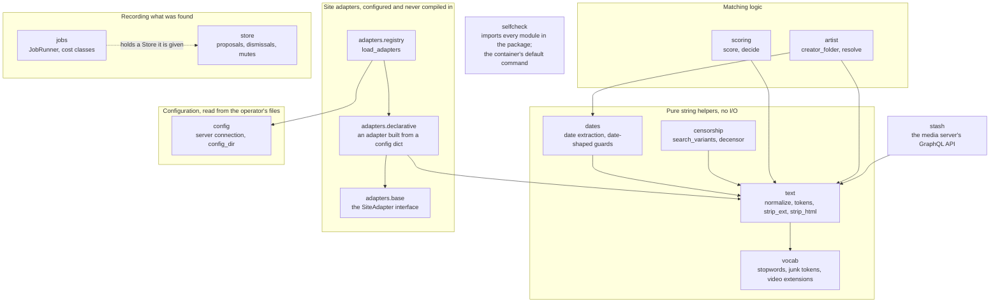

# cronicled

A foundation for an always-on companion to a
[Stash](https://github.com/stashapp/stash) media library. What is here today:
string and filename normalization, date extraction, a client for the media
server's own API, a pluggable site-adapter interface for matching against a
clip store, candidate scoring, creator attribution, a durable store for
proposed changes, a background job runner, and a leak guard for the repo
itself.

**Not yet built:** there is no scheduler, no inbox of proposed changes, and no
entry point that runs any of this continuously. The pieces above are library
code, called directly (including by tests); nothing here watches a library or
writes to it on its own.

Zero runtime dependencies: Python standard library only.

## Status

Early. The foundation layer described above is what exists; the always-on
service built on top of it — scheduled scans, a review/confirm inbox, writes
gated on user approval — has not been built yet. It has its own diagram, kept
separate from the ones describing what is built, on the
[architecture](docs/index.md#the-service-that-does-not-exist-yet) page.

## Quickstart

The runtime version is pinned in [`.python-version`](.python-version). There
are no runtime dependencies, so a checkout runs its own tests with nothing
installed beyond a matching Python:

```sh
python3 -m unittest discover -s tests -t . -v
```

There is no entry point to run yet. The container's default command is a
self-check that proves the pinned interpreter can import and run the package;
see [Running it, and the container](docs/container.md).

## The module map

Every module under `cronicled/`, and which of them import which. An arrow
points from a module to the module it imports, so it reads "depends on".



The matching path, the job lifecycle, and the planned service each have their
own diagram on the [architecture](docs/index.md) page.

## Documentation

The reference material lives on the site at <https://cronicled.pages.dev>, and
in [`docs/`](docs/) in this repository. This README is the overview; each fact
below is documented in exactly one of those pages, not in both.

- [Architecture](docs/index.md) — the four diagrams and the reasoning around
  them
- [Site adapters](docs/adapters.md) — the `owner_source` reference
- [Running it, and the container](docs/container.md) — the pinned runtime, the
  test invocations, the image and its mounts
- [Leak guard](docs/leak-guard.md) — what `scripts/check_leaks` scans, and the
  local `commit-msg` hook

## License

MIT
