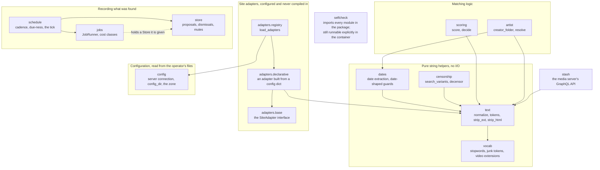

# cronicled

A foundation for an always-on companion to a
[Stash](https://github.com/stashapp/stash) media library. What is here today:
string and filename normalization, date extraction, a client for the media
server's own API, a pluggable site-adapter interface for matching against a
clip store, candidate scoring, creator attribution, a durable store for
proposed changes, a background job runner, a library scan that turns unmatched
files into proposals, a scheduler that decides when each producer is due, an
inbox that shows a proposal and takes approve/dismiss/mute/undo, an entry point
that serves it, and a leak guard for the repo itself.

**Running unattended:** `python -m cronicled` now builds a scheduler and starts
it. A library scan is registered at start-up with an appointment of its own and
no file limit, and the scheduler starts it when it is due — so proposals arrive
without anyone pressing anything. Nothing it starts writes to the media
server: a scan reads and proposes, and every proposal still waits for a person
to approve it.

The three unattended passes run overnight: 03:00, 03:20 and 03:40 in the
configured zone, staggered rather than sharing one appointment. A producer can
still be scheduled on an interval instead (`{"every": 86400}`), but an interval
is measured from the last recorded run and so drifts to whichever hour the
process last started at. A machine that was off across the appointed hour owes
the run once when it comes back, and the two days a year an hour repeats or does
not exist, it fires once.

Times on the page are shown in that same zone, from one setting
(`$CRONICLED_ZONE`, default UTC). Stored times are UTC and stay UTC: during the
hour a clock repeats, two local stamps an hour apart read alike and nothing
afterwards can order them.

**Not yet built:** a producer choosing to SKIP an appointment it missed instead
of being owed it. Owing is the answer for every producer today, argued where it
is implemented rather than left to a setting.

One runtime dependency: Jinja2, for autoescaped HTML. Everything else is the
Python standard library. The inbox renders text the project did not write —
filenames from disk, titles from a scraper — and autoescaping makes escaping a
property of the renderer rather than something a person must remember at every
interpolation.

## Status

The inbox is real: `python -m cronicled` serves proposals from the store,
takes approve/dismiss/mute/undo over POST, and applies or reverts a scene
through the media-server client — no write happens without a person clicking
one of those. Undo is not always complete: a proposal that carries a cover
image writes one the media server never exposes in a form its own undo
snapshot can restore, so that one field stays as the approve left it. The
inbox warns before an approve that would do this, and undo reports the same
residual afterward, rather than either one reading as a clean, full
reversal. The unattended half is real too: the entry point registers a scan
with a declared appointment, builds a scheduler over it and starts it, and the
page reports what the loop last did — when it ticked, what was due, and why
anything due was left alone.

A schedule says when in one of two ways, and both are useful. A cadence in
seconds is an INTERVAL measured from the last recorded run — right for
something that should run every few minutes, and the reason "nightly" used to
drift to whatever hour the process last restarted at. A stated time of day in a
named zone (`{"at": "03:00", "zone": "Europe/Lisbon"}`) keeps the same hour
across restarts instead, and is what the three unattended passes declare. A
stated time that was missed because the machine was off is OWED: it runs once
when the machine comes back, at whatever hour that is, rather than being skipped
or made up one night at a time. The two days a year a local clock repeats an
hour or skips one, it fires exactly once — on the first reading of a repeated
hour, and after a gap rather than before it.

The three appointments are deliberately twenty minutes apart. The cost classes
do not make one shared appointment safe: the three passes sit in three different
classes, each counted on its own, so a single 03:00 would start all three at
once — and two of them drive the media server's headless browser, which is the
very concurrency those classes cap at one job each. The scan goes first, because
what it proposes is the material the other two pass over.

What is still not decided is the choice between owing a missed appointment and
skipping it, which is one answer today and not a setting. That remaining gap
has its own diagram, kept separate from the ones describing what is built, on
the [architecture](docs/index.md#what-is-not-decided-yet) page.

## Quickstart

The runtime version is pinned in [`.python-version`](.python-version). The
project takes one runtime dependency (Jinja2 — see above), so a checkout
installs it before running the suite:

```sh
pip install -e .
python3 -m unittest discover -s tests -t . -v
```

`tests/test_web_render.py` imports Jinja2 through `cronicled/web/render.py`,
the module autoescaping was taken as a dependency to configure.

Serve the inbox against a store:

```sh
python -m cronicled --db /path/to/cronicled.sqlite3 \
    --server http://your-stash-host:9999 --api-key "$STASH_API_KEY"
```

Every flag above (plus `--config-dir`, `--host` and `--port`) also reads an
environment variable of the matching name (`$CRONICLED_DB`,
`$CRONICLED_SERVER`, `$CRONICLED_API_KEY`, `$CRONICLED_CONFIG_DIR`,
`$CRONICLED_HOST`, `$CRONICLED_PORT`) when the flag itself is not given — the
form the container image relies on, since a `docker run` argument list and an
`-e` list are both just ways of setting the same thing. The flag wins if both
are set.

That command also registers three unattended passes, each with an overnight
appointment of its own, and starts the loop that runs them when they are due: a
library scan with no file limit at 03:00, a pass over performer descriptions
that proposes cleaned text for any carrying markup at 03:20, and a tag pass that
looks for one tag written under more than one spelling and proposes a merge at
03:40. To change when any of them runs, to put one back on an interval, or to
turn one off, put a `schedule.json` in the config directory — see
`config/schedule.example.json` for the shape. An override wins over what the
producer declares, so an interval you already configured keeps working
untouched. A cadence that is not a positive number of seconds, a key that is not
`every`/`at`/`zone`/`enabled`, an entry naming both a cadence and a time, a
stated time with no zone or a zone this system does not know, and a producer
name that is not registered are all refused at start-up rather than leaving a
producer running at an hour nobody chose. Without a media server nothing is
scheduled at all and the entry point says so; without a configured site adapter
there is nothing to scan, so the scan alone is left out — the description and
tag passes read the media server's own text and vocabulary and need no store to
search.

### The zone

`$CRONICLED_ZONE` names the zone the overnight appointments are read in — and,
because it is one setting rather than two, the zone every timestamp on the page
is shown in. A page saying 3am while a pass runs at a different 3am is worse
than either being wrong alone. Unset, it is UTC: a stated zone that means the
same thing everywhere, rather than the host's, which in a container is UTC and
in nobody's head is. A name this system does not know is refused at start-up,
and the zone in use is printed on every start.

Timestamps in the database are UTC and are not affected by that setting. The
conversion happens on the way out, for reading only. Writing local times would
be unrecoverable rather than merely wrong: during the hour a clock puts back,
two rows an hour apart carry the same text, so nothing afterwards can tell which
came first.

An override that states a time still needs its own `zone` key; there is no
default there either, for the same reason — see `config/schedule.example.json`.

A scan pools unorganized files. If an earlier tool filled in guessed metadata
and marked those files organized, they are out of its reach: name the tag that
tool left behind in a `scan.json` in the config directory
(`{"marker_tag": "..."}` — see `config/scan.example.json` for the shape), and
organized files carrying that tag are scanned as well. Organized files without
it are not, which is what keeps a nightly pass from carrying a whole library.
The scan reads the tag and never removes it — shedding it belongs to whatever
applies a proposal. A `marker_tag` naming a tag the media server does not hold
fails the run rather than quietly selecting nothing, and configuring none
leaves the scan pooling exactly what it pooled before.

A proposed merge is judged in its own section of the inbox, not among the
scene proposals, because it is a different weight of decision: it names every
spelling and how many scenes each carries, and it says plainly that approving
it cannot be undone. A merge moves every item off the losing spellings and
deletes them; nothing records which items came from which tag, so there is no
snapshot to restore and no Undo is offered. Where three spellings share one
form, or two carry no evidence about which was meant, the cluster is reported
without a survivor and no Merge button at all — which one wins is a person's
call, not something to settle by picking the most popular.

It binds to loopback only (`127.0.0.1:8571` by default) — there is no
authentication, so the binding is the only thing standing between the page's
buttons and anyone who can reach the host. The container's default command
now starts this same inbox, bound to every interface *inside* the container
instead — loopback there would be unreachable from `docker run -p` — which
moves the actual protection to how that port is published; see
[Running it, and the container](docs/container.md) for the form that keeps
it local and what the other form exposes.

## The module map

Every module under `cronicled/`, and which of them import which. An arrow
points from a module to the module it imports, so it reads "depends on".



The matching path, the job lifecycle, and the planned service each have their
own diagram on the [architecture](docs/index.md) page.

## Documentation

The reference material lives on the site at <https://cabinetworks.github.io/cronicled/>, and
in [`docs/`](docs/) in this repository. This README is the overview; each fact
below is documented in exactly one of those pages, not in both.

- [Architecture](docs/index.md) — the four diagrams and the reasoning around
  them
- [Site adapters](docs/adapters.md) — the `owner_source` reference
- [Running it, and the container](docs/container.md) — the pinned runtime, the
  test invocations, the image and its mounts
- [Leak guard](docs/leak-guard.md) — what `scripts/check_leaks` scans, and the
  local `commit-msg` hook
- [Contributing](CONTRIBUTING.md) — the standing rule for trusting a new test

## The published image

Every push to the default branch publishes a multi-architecture image to
`ghcr.io/cabinetworks/cronicled`, tagged with the commit SHA:

```sh
docker pull ghcr.io/cabinetworks/cronicled:<commit-sha>
```

**`latest` follows the default branch and is published.** It names the newest
build of that branch, not a reviewed release, and it moves under anyone who
pulls it — while what it starts is an unauthenticated page whose buttons write
to a library. A commit SHA or a released version makes no such promise, and
both are still published; a release tag deliberately does not move `latest`.
[The container page](docs/container.md) has the tagging scheme and the
mounts.

## License

MIT
