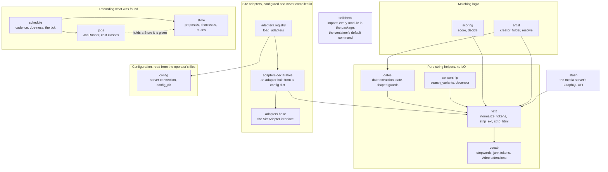
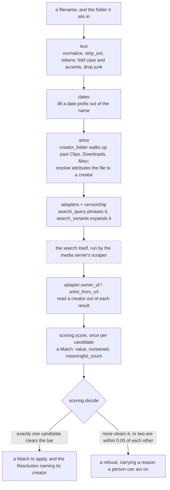
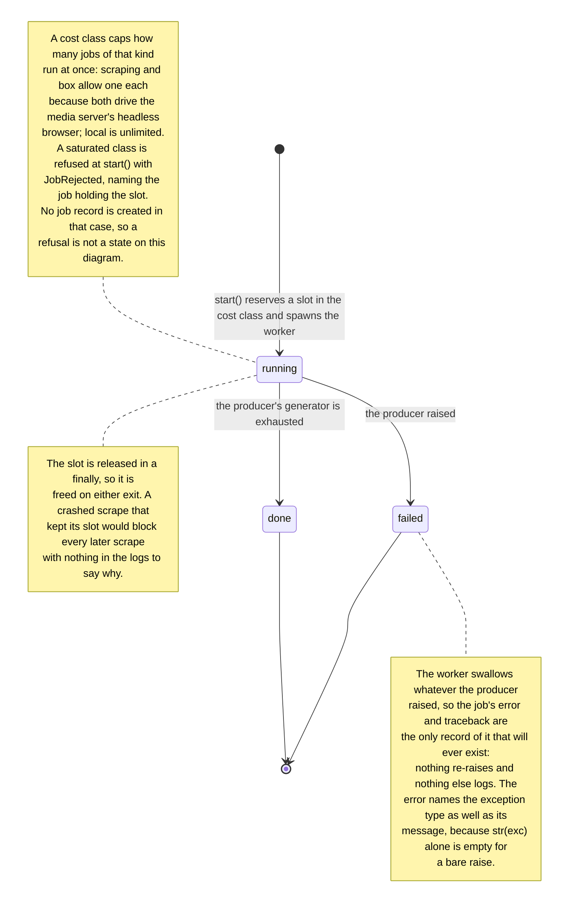
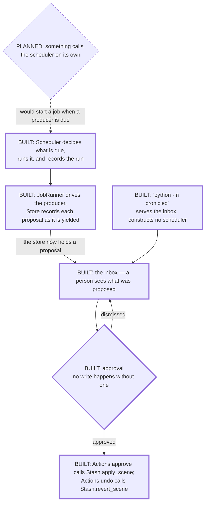

# Architecture

This page describes what the package is made of and how the pieces fit
together. It is deliberately explicit about a distinction the diagrams below
would otherwise blur: **everything in the first three diagrams exists in the
repository today; the fourth mixes what exists with the one thing that
still does not.**

There is now an inbox of proposed changes, an entry point that serves it, and
an approval gate: `python -m cronicled` serves what the store holds, and
nothing writes to the media server except through an explicit approve or
undo. What does not exist is anything that runs unattended.

A scheduler is part of the library code: it resolves each producer's cadence,
decides what is due, runs it and records the run. What does not exist is a
process that constructs one and calls it on a timer. A scheduler nobody starts
is a component, not a service, and the fourth diagram is drawn around that one
remaining gap.

## The module map

Every module under `cronicled/`, and which of them import which. An arrow
points from a module to the module it imports, so it reads "depends on".

A few things the shape of that graph is saying:

- **The helpers know nothing about the layers above them.** `text` depends only
  on `vocab`; `vocab` depends on nothing. That is what lets the matching rules
  be tested against strings rather than against a library.
- **`store` and `jobs` import nothing from the rest of the package.** The runner
  takes a store at construction and takes producers by registration, so neither
  of them knows what a filename or a candidate title is. A producer is anything
  with `name`, `cost` and a `produce(ctx)` generator.
- **Nothing imports `stash`.** The client is a leaf: matching logic never
  reaches for the media server on its own.
- **`censorship` has no in-package caller.** Each adapter carries its own
  substitution map, and expanding a query with it is the caller's step.
- **No module is compiled against a particular store.** `adapters.registry`
  reads adapters out of the operator's config; see
  [Site adapters](adapters.md).
- **`config` has exactly one in-package importer**, and it is that registry.
  Its other half — the media server's URL and API key — is read by whoever
  constructs a `Stash`, deliberately, so the client can be built against a fake
  transport in a test with no config file existing at all.

## The matching path

How a filename becomes either a match or a refusal. Each box names the module
that does that step.

!!! warning "No module in this package runs this sequence"

    There is no function you can call that goes from one end of this diagram to
    the other. The arrows are the order in which each step's inputs become
    available, not a call graph of something already written. The dashed box is
    not part of this package at all: the media server runs the search, and this
    project only says how to phrase it and how to read the results back.

The two ends of that diagram are not symmetrical, and deliberately so.
Refusing costs somebody a review; a wrong automatic write costs a corrupted
file that nobody notices. So `decide` refuses rather than guesses:

- a score below the threshold refuses, and the reason names the candidate that
  came *closest to being eligible* rather than the one with the highest raw
  value — only the near miss tells a reader something they can act on;
- a match resting on a single generic word needs 0.9 or better before it counts
  as evidence at all;
- two eligible candidates within `AMBIGUITY_MARGIN` (0.05) of each other are a
  dilemma, not a decision, and both are refused rather than one being picked by
  list order.

`artist.resolve` follows the same principle from the other direction. When the
folder names one creator and the filename names another, the folder wins —
somebody chose to file the video there — but the filename's answer comes back
in `competing`, and folder text that no guard would accept as a name comes back
in `rejected_folder`. Neither is dropped. A library where those turn up often
is one whose filing convention is not what the operator assumed, and that is
the most useful signal available.

## Job lifecycle

`jobs.JobRunner` runs a producer on a background thread so a long scan cannot
block whatever started it. A job has exactly three states, and `Job.state` is
always one of them.

Two details worth knowing before writing a producer:

- **`produce` must be a generator**, and `start()` refuses anything else with a
  `TypeError`. The runner records each proposal as it is yielded, so a scan that
  dies partway through a long library keeps what it already found; a `produce`
  that built a list and returned it would lose all of them on the same failure.
- **A producer never touches the store.** It gets a `ctx` with one method,
  `log(message)`. Persistence, and the dismissal and mute rules that make a
  reviewer's past decisions stick, belong to the runner alone — a producer
  writing to the store directly could bypass them.

The runner also forgets. It holds every running job and the most recent
finished ones — two hundred by default, a constructor argument — because a
process that stays up for weeks would otherwise keep a record of every job it
has ever run, and `jobs()` would grow with it. Running jobs are never dropped:
they are already bounded by the cost-class limits, and dropping one would erase
the only record of work still in flight. What is dropped is admitted rather
than hidden — `jobs()` carries the number of finished jobs evicted alongside
the snapshots, so a truncated history cannot be read as the whole of what ever
ran, and asking for an evicted job raises `JobForgotten` rather than the plain
`KeyError` of an id that never existed. "That ran and I no longer remember it"
and "that never happened" send a caller to different places.

And it can be shut down. `close(timeout=None)` stops the runner accepting work
and waits for the jobs already running, returning `True` if they all finished
and `False` if the timeout expired with work still in flight — a deploy asking
"is it safe to kill this process" gets two answers there and has to act
differently on each. After `close()`, `start()` raises `RunnerClosed`, and that
refusal is the point: without it a shutdown races a new job, and the wait means
nothing because a third job begins behind the two being waited for. It is not
cancellation — nothing interrupts a producer, and a job still running when the
timeout expires keeps running on its daemon thread, which the process exit will
kill wherever it has got to.

## The service that does not exist yet

Only one node below is **planned**. Everything else in this diagram now has
code behind it — it is drawn separately from the three above only because it
carries the one node that does not exist, and mixing a planned node into a
diagram of what is built is how a picture starts claiming more than the prose
does.

One node in that diagram is dashed, and it is the only one that does not exist:
whatever would call the scheduler without a person asking. Everything else —
the entry point, the inbox, the approval gate, and the caller that applies or
reverts a scene — is built and tested.

The scheduler being solid is worth reading carefully, because it predates this
diagram's rewrite. It decides what is due and starts it, and it is tested doing
so — but the arrow *into* it is still planned, which is the whole point:
nothing constructs a scheduler, so nothing ever calls the code that would run
producers unattended. `python -m cronicled` does not close that gap; it serves
the inbox and answers a person's clicks, and starts no timer of its own.

The store already keeps the record an inbox reads — proposals, their states,
dismissals and mutes — and the inbox now reads it: a person sees each
proposal, approves, dismisses, mutes or undoes it, and nothing is written to
the media server except through that approval. What is missing is only the
part that would decide *when* to run a scan without someone asking first.
